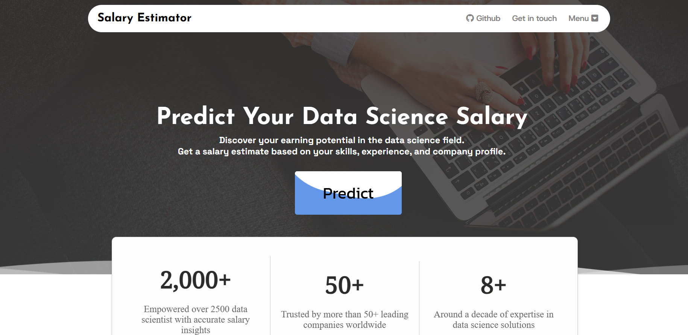
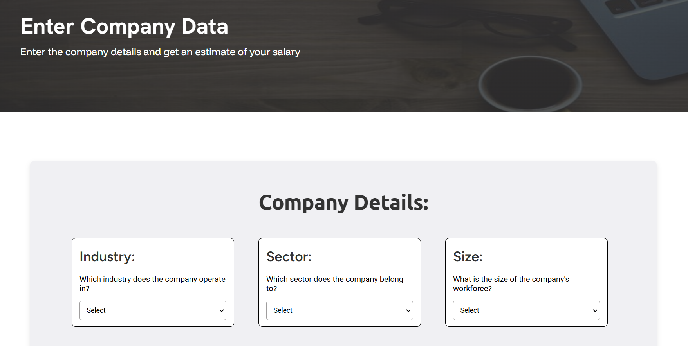

<h1 align="center"> Data Science Salary Estimator </h1>
<h3 algin="center"> End to End Data Science Project: "Predicting Salary of a Data Scientist in India" </h3>


## 📌 Project Overview
   - Developed a robust model to predict the salary of Data Scientists in India.
   - Collected data from glassdoor website, scraped over 900 job postings.
   - Cleaned and pre-processed the raw data. 
   - Engineered featues, created new features that captures the importance of tools like 'python', 'r', 'sql', 'aws', 'spark', 'genai', 'LLMs' for a data science role.
   - Trained the model by utilizing different machine learning algorithms, optimized it using cross validation, gridsearch methods.
   - Deployed the model as an application using Flask, pickle.


# 🧱 Project Workflow 
## 1. Data Collection:
   - Using selenium framework I scraped the Data Science job postings within India from the glassdoor website. 
   - Scraped all the job postings from the website (around 900 job postings).
   - For each job I collected the following:
       * Company Name
       * Job Title
       * Salary Estimate 
       * Location of the job
       * Job Description
       * Rating of the company
       * Size of the company (total number of employees working)
       * Industry
       * Sector
       * Founded date of the company
       * Ownership type of the company
       * Revenue of the company
   - Took me a while to complete the scraping process (around 3 hours for the scraping process to complete).


## 2. Data Cleaning & Preprocessing: 
   - Once the data is scraped I performed data clearning process and also prepared the data for model building.
   - During the clearning process I did the following:
        * Filled the missing values using the most suitable method (there were a lot of missing values so couldn't just drop it)
        * Removed unwanted text, black spaces from the values of different columns
        * Parsed numeric data from 'Salary Esitmate' column.
        * Found the age of the company using 'Founded' column.
        * Created the following new columns for the skills, tools listed in 'Job Description' column 
             * Python
             * r
             * sql
             * aws
             * spark
             * genai
             * LLMs

## 3. Exploratory Data Analysis & Feature Engineering:
   - After the data is clearned I analyzed the data to find hidden patterns, trends other relationship between features.
   - Performed both univariate and bivariate/multi-variate analysis.
   - Visualized the distribution of each features and explored the values and their counts of each features.
   - Visualized the presence of missing values in the dataset.
   - Found relationship (correlation) between features.
   - Found relationship between the revenue of the company and the salary they provide.
   - Found the companies which has higher ratings (more than 4.0 & 4.5)
   - Found the common industries and sectors the company is in and so on.

  
   
  
  

## 4. Model Building:
   - During the model building process I first converted the categorical values into dummy variables and I split the data into train and test set with a test size of 20%.
   - Then I tried different models and evalutated them using mean squared error and mean absolute error. I used the following models :
        - Multiple Linear regression - As a base model 
        - Ridge regresssion - Used both L1 and L2 to handle outliers  
        - Lasso regression 
        - Random forest regressor - Finally used random forest as it would be a good fit for sparsity associated with the data.
   - Out of all the models random forest regressor's performance was better and error rate was lower.

## 5. Productionization:
   - In the final step, to productionize the model I build a flask API endpoint (application) using the flask module.
   - The app takes in a request with a list of values of a job posting and returns the estimated salary.v
   - For simplicity the app was hosted on a local webserver. 

<br>
        
# 🛠 Tech Stack
| Technology | Description |
|------------|-------------|
| **Python** | Programming language used  |
| **Selenium** | Scraping real world data |
| **Flask** | Web framework for UI and API integration |
| **HTML & CSS** | Frontend design and styling |
| **Pandas** | Cleaning and preprocessing the data |
| **Numpy** | Performing numerical operations |
| **Matplotlib** | Visualization of the data |

<br>

# 🚀 Installation & Setup

### 1️⃣ Clone the Repository
```sh
git clone https://github.com/Dhanush-Raj1/Data-Science-Salary-Project.git
cd Data-Science-Salary-Project
```

### 2️⃣ Create a Virtual Environment
```sh
conda create -p envi python==3.9 -y
source venv/bin/activate   # On macOS/Linux
conda activate envi     # On Windows
```

### 3️⃣ Install Dependencies
```sh
pip install -r requirements.txt
```

### 4️⃣ Run the Flask App
```sh
python app.py
```

The app will be available at: **http://127.0.0.1:5000/**

<br>

# 🌐 Usage Guide    
1️⃣ Open the web app in your browser.    
2️⃣ Click the predict on the home page of the web app.  
3️⃣ Enter the company details in the respective dropdowns.   
4️⃣ Click the predit button and the predicted results will appear.  

<br>

# 📸 Screenshots  
### 🟠 Home Page  


<br>

### 🔵 Predict Page


<br>

# 🎯 Future Enhancements
✅ Improved accuracy of the model with advanced fine tunning  
✅ Real-Time Prediction System  
✅ Automated Retraining Pipeline  
✅ Improve UI with a more interactive design.    
✅ Customer Retention Strategy Recommender.  
✅ Anomaly Detection for Unexpected Churn

<br>

# 🤝 Contributing  
💡 Contributions, issues, and pull requests are welcome! Feel free to open an issue or submit a PR to improve this project. 🚀 

# 📄 License  
This project is licensed under the MIT License – see the [LICENSE](LICENSE) file for details.  
