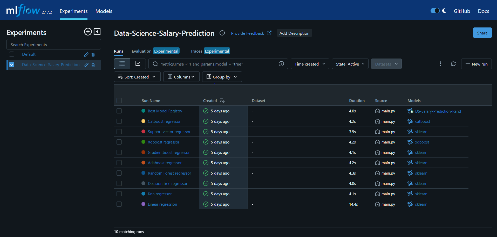

<h1 align="center"> Data Science Salary Estimator </h1>
  
<p align="center">
  
  
  
  
  
  
  
  

</p>
  
<h3 align="center"> End to End MLOps Data Science Project: "Predicting Salary of a Data Scientist in India" </h3>
<h3 align="center"> With MLflow Experiment Tracking </h3>

<br>

## 🚀 Live Demo
🌐 The application is deployed and live on Render   
👉 [Access the web app here](https://data-science-salary-project.onrender.com/)  
  
> [!NOTE]  
> The initial load of the web app may take 30-60 seconds as the service spins up.  
  
> [!TIP]  
> For the best experience, please refer to the [Usage Guide](#-usage-guide) section below to learn how to navigate and use the web app effectively.
  
<br>

## 📌 Project Overview
   - Developed a robust model to predict the salary of Data Scientists in India.
   - Collected data from glassdoor website, scraped over 800 job postings.
   - Cleaned and pre-processed the raw data.
   - Engineered new featues, created new features that captures the importance of tools like 'python', 'r', 'sql', 'aws', 'spark', 'genai', 'LLMs' for a data science role.
   - Trained multiple machine learning algorithms and evaluated them using cross-validation and GridSearch.
   - **Integrated MLflow to track experiments, metrics, hyperparameters, and model artifacts automatically.**
   - Deployed the best-performing model as a Flask API.
   - Successfully hosted the web app on **Render** for continuous availability


# 🧱 Project Workflow 
## 1. Data Collection:
   - Using selenium framework I scraped the Data Science job postings within India from the glassdoor website. 
   - Scraped all the job postings from the website (around 900 job postings).
   - For each job I collected the following:
       * Company Name
       * Job Title
       * Salary Estimate 
       * Location of the job
       * Job Description
       * Rating of the company

## 2. Data Cleaning & Preprocessing: 
   - Once the data is scraped I performed data clearning process and also prepared the data for model building.
   - During the clearning process I did the following:
        * Filled the missing values using the most suitable method (there were a lot of missing values so couldn't just drop it)
        * Removed unwanted text, black spaces from the values of different columns
        * Parsed numeric data from 'Salary Esitmate' column.
        * Found the age of the company using 'Founded' column.
        * Created the following new columns for the skills, tools listed in 'Job Description' column:
             * Python
             * r
             * sql
             * aws
             * spark
             * genai
             * LLMs
       * Created new features for type of roles, seniority levels. 

## 3. Exploratory Data Analysis & Feature Engineering:
   - After the data is clearned I analyzed the data to find hidden patterns, trends other relationship between features.
   - Performed both univariate and bivariate/multi-variate analysis.
   - Visualized the distribution of each features and explored the values and their counts of each features.
   - Visualized the presence of missing values in the dataset.
   - Found relationship (correlation) between features.
   - Found relationship between the revenue of the company and the salary they provide.
   - Found the companies which has higher ratings (more than 4.0 & 4.5)
   - Found the common industries and sectors the company is in and so on.

  
   
  
  

## 4. Model Building with MLFlow tracking:
  - Split the dataset into train and test sets.
  - Trained multiple models (Linear Regression, Ridge, Lasso, Random Forest, XGBoost, CatBoost).
  - **Logged model parameters, metrics, and artifacts to MLflow**.
  - **Used MLflow to register and compare the best-performing model based on R² score.**

## 5. Productionization & Deployment:
   - Built a Flask API endpoint that takes in job posting details and returns estimated salary.
   - Designed an intuitive web interface using HTML and CSS for user interaction..
   - Deployed the application on Render with continuous availability.
   - The live application is accessible to anyone with internet access.

<br>
        
# 🛠 Tech Stack
| Technology | Description |
|------------|-------------|
| **Python** | Programming language used  |
| **Render** | Cloud platform for deployment and hosting|
| **Selenium** | Scraping real world data |
| **Flask** | Web framework for UI and API integration |
| **MLflow** | Experiment tracking and model registry |
| **HTML & CSS** | Frontend design and styling |
| **Pandas** | Cleaning and preprocessing the data |
| **Numpy** | Performing numerical operations |
| **Matplotlib** | Visualization of the data |

<br>

# 🚀 Installation & Setup

### 1️⃣ Clone the Repository
```sh
git clone https://github.com/Dhanush-Raj1/Data-Science-Salary-Project.git
cd Data-Science-Salary-Project
```

### 2️⃣ Create a Virtual Environment
```sh
conda create -p envi python==3.9 -y
source venv/bin/activate   # On macOS/Linux
conda activate envi     # On Windows
```

### 3️⃣ Install Dependencies
```sh
pip install -r requirements.txt
```

### 4️⃣ Start MLflow Tracking Server
```sh
mlflow ui --backend-store-uri sqlite:///mlruns.db  --default-artifact-root ./mlruns --host 127.0.0.1 --port 8000
```
Access the mlflow UI at: http://127.0.0.1:8000

### 5️⃣ Run the Training Script
```sh
python main.py
```

### To access the Flask App
```sh
python app.py
```
The app will be available at: **http://127.0.0.1:5000/**

<br>

# 🌐 Usage Guide    
1️⃣ Open the web app in your browser.    
2️⃣ Click the predict on the home page of the web app.  
3️⃣ Enter the company details in the respective dropdowns.   
4️⃣ Click the predit button and the predicted results will appear.  

<br>

# 📸 Screenshots  
### MLFlow UI (model logging, best model registry)


<br>

### 🟠 Home Page  


<br>

### 🔵 Predict Page


<br>

### Result 


<br>

# 🎯 Future Enhancements  
✅ Add more job platforms like LinkedIn and Indeed for better data    
✅Host MLflow Tracking Server remotely for persistent experiment logs  
✅Automate retraining pipelines with GitHub Actions and CI/CD  
✅Add real-time salary updates based on market trends   

<br>

# 🤝 Contributing  
💡 Contributions, issues, and pull requests are welcome! Feel free to open an issue or submit a PR to improve this project. 🚀 

# 📄 License  
This project is licensed under the Apache License – see the [LICENSE](LICENSE) file for details.  
